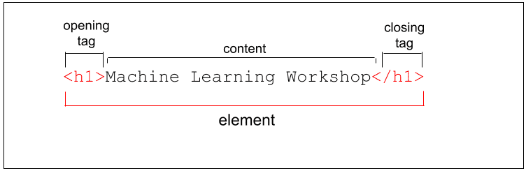
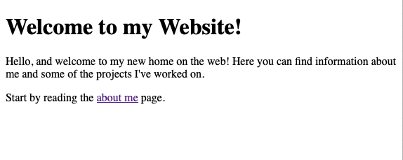

#What is HTML?
https://www.youtube.com/watch?v=ok-plXXHlWw

#HTML Document
https://www.w3schools.com/html/html_intro.asp

#Head Head
https://www.w3schools.com/html/html_head.asp

#HTML Title
https://www.w3schools.com/html/html_page_title.asp

#HTML-Elements
https://www.w3schools.com/html/html_elements.asp


#Attributes
https://www.w3schools.com/html/html_attributes.asp

#Heading
https://www.w3schools.com/html/html_headings.asp

#Paragraph
https://www.w3schools.com/html/html_paragraphs.asp

#Comments
https://www.w3schools.com/html/html_comments.asp

#Images
https://www.w3schools.com/html/html_images.asp

#Div
https://www.w3schools.com/html/html_div.asp

#Links
https://www.w3schools.com/html/html_links.asp

#Buttons
https://www.w3schools.com/tags/tag_button.asp

#Styles
https://www.w3schools.com/html/html_styles.asp

#Colors
https://www.w3schools.com/html/html_colors.asp

-------------------------------------------
ASSIGNMENT 1<br>
Create a html page like below. 
On click of `about me` text, it will redirect to Google.com


SOLUTION 1
```
		<h1>Welcome to my Website!</h1>
		<p>
			Hello, and welcome to my new home on the web! <br>
			Here you can find information about me and some of the projects I've worked on.
		</p>
		<div>
			Start by reading the about <a href="http://www.google.com">about me</a> page.
		</div>
```
