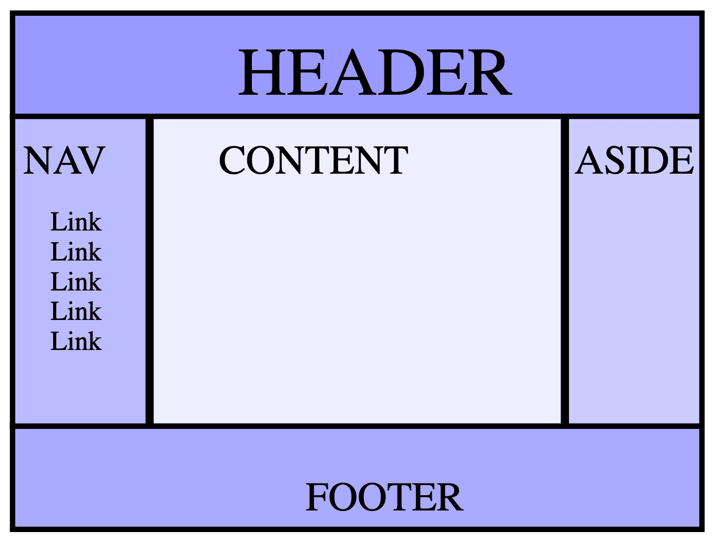
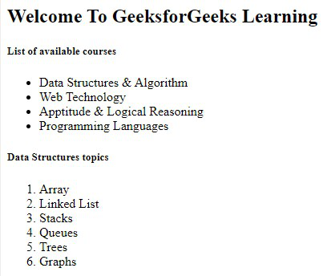

#List Tags
#Ordered List

```
<ol>
  <li>Blendan Smooth
  <li>Hoover Sukhdeep
  <li>Toasty McToastface
</ol>

```

#Unorderd List

```
<ul>
  <li>Blendan Smooth
  <li>Hoover Sukhdeep
  <li>Toasty McToastface
</ul>
```

#`<em> or <strong>`

#meta

```
<meta name="viewport" content="width=device-width, initial-scale=1, user-scalable=1" />
```

#Semantic HTML

```
<header>
  <h1>Three words</h1>
  <nav>
    <a>one word</a>
    <a>one word</a>
    <a>one word</a>
    <a>one word</a>
  </nav>
</header>
<main>
  <header>
    <h1>five words</h1>
  </header>
  <section>
    <h2>three words</h2>
    <p>forty-six words</p>
    <p>forty-four words</p>
  </section>
  <section>
    <h2>seven words</h2>
    <p>sixty-eight words</p>
    <p>forty-four words</p>
  </section>
</main>
<footer>
  <p>five words</p>
</footer>
```

#Document structure


```
<body>
  <header>Header</header>
  <nav>Nav</nav>
  <main>Content</main>
  <aside>Aside</aside>
  <footer>Footer</footer>
</body>
```

#`<article>`

#`<section>`

<hr/>
#ASSIGNMENT 2


