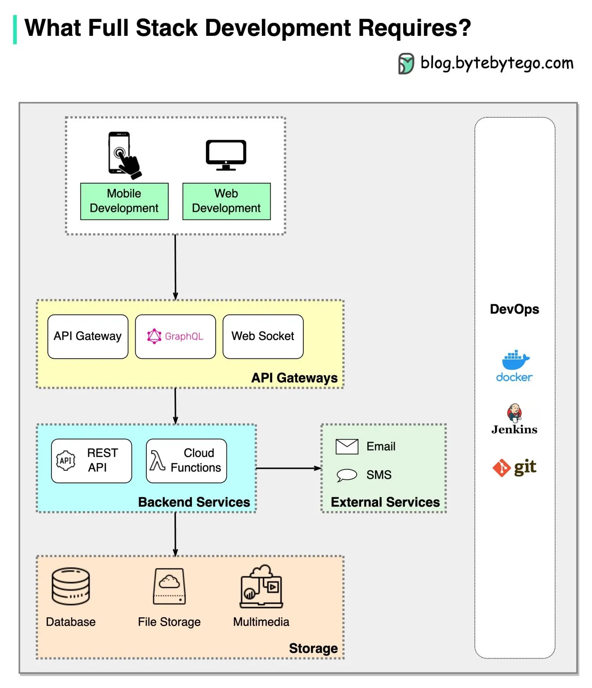

# frontend-notes

  
What is Programming?

  

  <a href="https://carlcheo.com/wp-content/uploads/2014/12/which-programming-language-should-i-learn-first-pdf.pdf" target="_blank" title="Link to pdf of programming language guide">Which programming language</a>
  

  
What is Full Stack?

  

  
What is Frontend?

  <a href="https://roadmap.sh/frontend" target="_blank" title="Title">Components of frontend</a>

